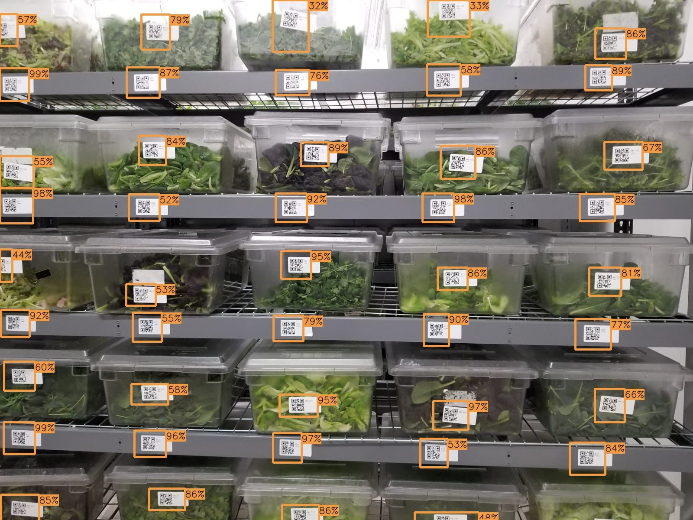

# QR-code-localization-YOLOv3
Detection and localization of QR codes using YOLOv3-tiny with darknet. The filed attached (yolov3-custom.ipynb) shows the process I went through to train yolov3 on Google Colab. A more indepth description of the project can be found at my personal site: https://www.gabriel-bellport.com/projects/localizing-qr-codes-with-yolov3-2019. The results of my model are shown below. You can also see how the model performs on a video on my website.

